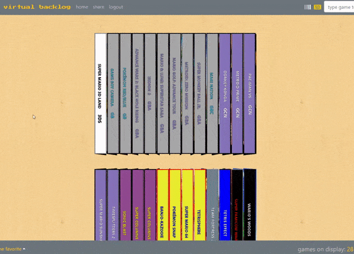

# virtual-backlog
A full-stack MERN React app for users to store and display their entire videogame collections on animated 3D bookshelves.

# goals
Game collectors love to display, show off, and track their physical library on a shelf, but the same isn’t possible for digital collections. To solve the problem, we created a full-stack MERN app to store and display a videogame collection (digital, physical, or both) in 3D. Any game can be added to the user’s library by title search or by barcode scanning; games can be edited and sorted on the fly to the user’s liking (by system, title, favorite, etc); and custom links are provided for collectors to show off their library to anyone, whether they have an account or not.

# guest account
Users can sign in by registering for their own, free account at https://virtualbacklog.herokuapp.com/register, or logging in with the guest account (username: guest; password: abc123).

# instructions
Games can be added to the collection by using the search input in the top-right of the screen, or by switching to the barcode scanner in the same location. After selecting a game and adding its details, it will be stored in the database and appear onscreen, provided that it falls under the current sorting parameters. The default sort option is "favorite". These options can be altered by selecting new sorting rules on the bottom left of the screen. Users can search by title, system, beaten, physical/digital, and custom tags that can be added inside the 3D games themselves. To share your collection with your friends, click the "share" button at the top-left of the navbar to generate your custom link.

Your collection may end up looking something like this: 

